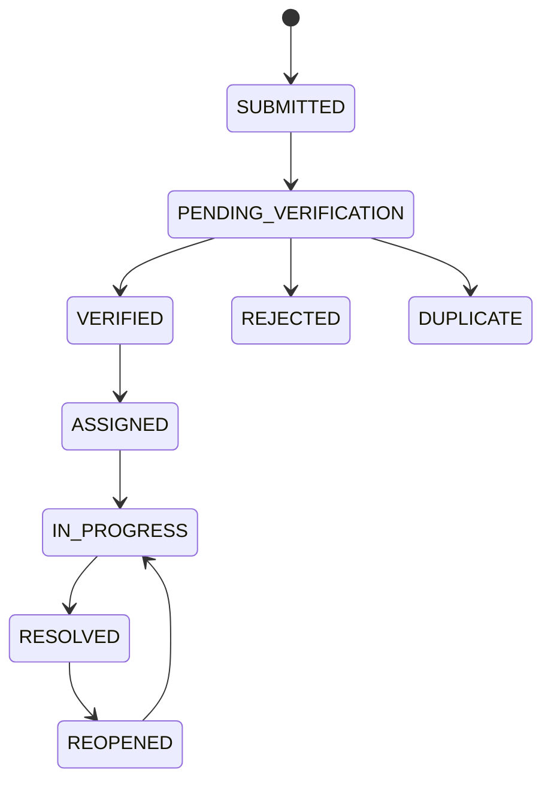

# Incident lifecycle

```mermaid
stateDiagram-v2
  [*] --> SUBMITTED
  SUBMITTED --> PENDING_VERIFICATION
  PENDING_VERIFICATION --> VERIFIED
  PENDING_VERIFICATION --> REJECTED
  VERIFIED --> ASSIGNED
  ASSIGNED --> IN_PROGRESS
  IN_PROGRESS --> RESOLVED
  RESOLVED --> REOPENED
  REOPENED --> IN_PROGRESS
  PENDING_VERIFICATION --> DUPLICATE
```

Every transition is persisted in the incident event history. Duplicate candidates
are advisory; only an authorized operator may classify a report as duplicate.
